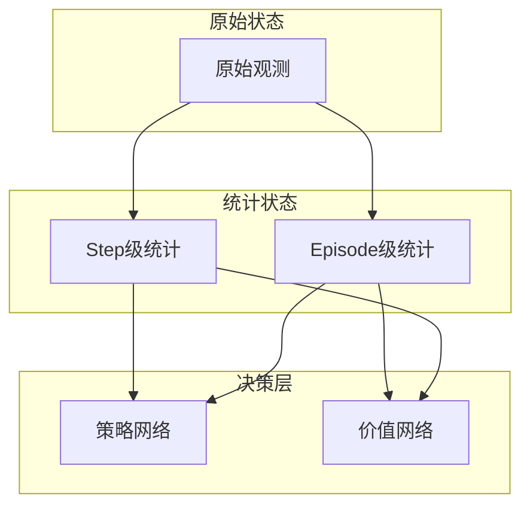

[](https://docs.omniverse.nvidia.com/isaacsim/latest/overview.html)
[](https://isaac-sim.github.io/IsaacLab)
[](https://docs.python.org/3/whatsnew/3.10.html)
[](https://releases.ubuntu.com/20.04/)
[](https://www.microsoft.com/en-us/)
[](https://pre-commit.com/)
[](https://opensource.org/license/mit)

[视频](https://www.bilibili.com/video/BV1rQK8zQEo2/?vd_source=2a13aee779bc6301268e18d749a04db4)

[基于统计的强化学习控制--源起](https://zhuanlan.zhihu.com/p/1924906978565654310)

[基于统计的强化学习控制--开篇](https://zhuanlan.zhihu.com/p/1925295102420579064)

代码在work分枝,还在完善中。

# 基于多粒度统计的机器人运动控制学习研究
**作者**：  曾良军<sub>1</sub>，陈小波，费越<sub>1</sub>，陈宏力<sub>2</sub>

1:复旦大学义乌研究院人工智能与多媒体实验室
2:江西应用科技学院


本文提出了一种基于统计特征的强化学习控制框架，通过实时计算运动状态的统计特性(均值、方差等)来增强传统强化学习算法。该方法采用双通道架构，分别将统计特征用于观测构建和激励计算。本研究为强化学习控制提供了新的特征工程思路；相比传统方法具有以下优势：
1. 策略性能优越：在复杂地形的训练时间和适应能力均表现得更好（无需额外传感器）。
2. 系统鲁棒性强：统计对于噪声的天然过滤与规律提取能力。
3. 系统具有良好的自适应能力，无需目前很方法中设定相位和步频信息。
4. 本方法可自由扩展任一现有或将实现架构；并能提供助力。

### 贡献
1. 提出增量式多粒度统计特征体系
2. 设计双通道统计RL架构
3) 实现运动状态自适应的基于统计的激励机制

## 1. 引言

### 1.1 研究背景与范式创新
当前强化学习在机器人控制中存在三大挑战：
1. 激励稀疏性导致训练效率低下
2. 状态表征能力不足限制策略性能
3. 系统适应性差难以应对动态环境

目前止还没有基于历史状态用于激励塑形的方面的实践；在己查阅资源中应该是在这个方向上第一个进行相关设计和实践。
目前激励是基于当前状态进行设计，用当下决策末来这在一定程度上带有一定局限性。基于统计进行激励设计是用历史决策末来；具有全局前瞻性。

### 1.2 "统计特征双通道"新范式



## 2. 方法论

### 2.1 统计特征计算与状态表征
本方法创新性地将统计特征同时用于激励计算和状态表征：

1. **双重功能设计**：
   - 激励计算：作为评估指标
   - 状态表征：作为观测信号
   ```mermaid
   graph LR
     A[原始数据] --> B[统计特征]
     B --> C[激励计算]
     B --> D[状态观测]
   ```

2. 统计计算：
采用改进的Welford算法实现实时统计：

   - **均值更新**：
   $$
   \Delta = x_t - \mu_{t-1} \\
   \mu_t = \mu_{t-1} + \Delta/t
   $$

   - **方差更新**：
   $$
   \sigma_t^2 = \frac{(t-1)\sigma_{t-1}^2 + \Delta(x_t-\mu_t)}{t}
   $$


### 2.2 激励函数设计
基于统计特征，本方法构建了四种激励计算策略：

- **均值自比较**：
  使用公式
  $$
  R=\frac{1}{C}\sum\exp(-\|\mu_i-\mu_j\|/\sigma)
  $$
  计算不同关节间的均值差异，适用于评估对称性运动；

- **均值零比较**：
  $$
  R=\frac{1}{N}\sum\exp(-\|\mu_i\|/\sigma)
  $$
  对比关节均值与零的偏差，适用于静止或平衡状态；

- **方差自比较**：
  使用公式
  $$
  R_{var} = \exp\Big(-\Big(\frac{\|\sigma\|-\sigma_{target}}{\sigma_{target}}\Big)^2\Big)
  $$
  对运动平滑性进行评估，其中 \( \sigma \) 为实际统计方差，\( \sigma_{target} \) 为预设目标方差；

- **均值与方差组合**：
  综合上述两种激励，得到总激励值
  $$
  R = \frac{r_{mean}+ \lambda\, r_{var}}{1+\lambda}
  $$

  在该公式中，\( \ lambda \) 为权重系数，通过调节可适应不同任务需求。总体设计确保激励信号能同时反映局部运动波动与全局运动趋势。


## 3. 结论与范式意义
本文提出的"统计特征双通道"框架开创了强化学习新范式：

1. **范式创新**：
   - 统一了激励计算和状态表征的统计基础
   - 建立了从原始数据到策略优化的双通道架构
   - 实现了感知-决策的闭环优化

2. 框架价值：

1. **双重应用价值**：
   - 作为激励信号：引导策略优化方向
   - 作为状态特征：增强模型感知能力
   ```mermaid
   graph TB
     S[统计特征] -->|作为激励| R[策略优化]
     S -->|作为观测| O[状态表征]
   ```

2. 框架优势：

1. **性能优势**：
   - 训练阶段：收敛速度更快
   - 系统开销：

2. **技术特色**：
   - "统计特征双通道"新范式

3. **应用价值**：
   - 可应用于四足机器人、双足机器人等控制系统


# Citation
Please use the following bibtex if you find this repo helpful and would like to cite:

```bibtex
@misc{HUMANOID,
  author = {liangjun},
  title = {基于多粒度统计的机器人运动控制学习研究},
  year = {2025},
  publisher = {GitHub},
  journal = {GitHub repository},
  howpublished = {\url{https://github.com/zengliangjun/HUMANOID}},
}

@misc{CARTPOLE,
  author = {liangjun},
  title = {基于统计的强化学习控制},
  year = {2025},
  publisher = {GitHub},
  journal = {GitHub repository},
  howpublished = {\url{https://github.com/zengliangjun/SRL_CARTPOLE}},
}

@article{he2025asap,
  title={ASAP: Aligning Simulation and Real-World Physics for Learning Agile Humanoid Whole-Body Skills},
  author={He, Tairan and Gao, Jiawei and Xiao, Wenli and Zhang, Yuanhang and Wang, Zi and Wang, Jiashun and Luo, Zhengyi and He, Guanqi and Sobanbabu, Nikhil and Pan, Chaoyi and Yi, Zeji and Qu, Guannan and Kitani, Kris and Hodgins, Jessica and Fan, Linxi "Jim" and Zhu, Yuke and Liu, Changliu and Shi, Guanya},
  journal={arXiv preprint arXiv:2502.01143},
  year={2025}
}

@article{gu2024humanoid,
  title={Humanoid-Gym: Reinforcement Learning for Humanoid Robot with Zero-Shot Sim2Real Transfer},
  author={Gu, Xinyang and Wang, Yen-Jen and Chen, Jianyu},
  journal={arXiv preprint arXiv:2404.05695},
  year={2024}
}

@inproceedings{gu2024advancing,
  title={Advancing Humanoid Locomotion: Mastering Challenging Terrains with Denoising World Model Learning},
  author={Gu, Xinyang and Wang, Yen-Jen and Zhu, Xiang and Shi, Chengming and Guo, Yanjiang and Liu, Yichen and Chen, Jianyu},
  booktitle={Robotics: Science and Systems},
  year={2024},
  url={https://enriquecoronadozu.github.io/rssproceedings2024/rss20/p058.pdf}
}

@article{mittal2023orbit,
   author={Mittal, Mayank and Yu, Calvin and Yu, Qinxi and Liu, Jingzhou and Rudin, Nikita and Hoeller, David and Yuan, Jia Lin and Singh, Ritvik and Guo, Yunrong and Mazhar, Hammad and Mandlekar, Ajay and Babich, Buck and State, Gavriel and Hutter, Marco and Garg, Animesh},
   journal={IEEE Robotics and Automation Letters},
   title={Orbit: A Unified Simulation Framework for Interactive Robot Learning Environments},
   year={2023},
   volume={8},
   number={6},
   pages={3740-3747},
   doi={10.1109/LRA.2023.3270034}
}
```


## 🎉 Acknowledgments

This repository is built upon the support and contributions of the following open-source projects. Special thanks to:

- [ASAP](https://github.com/LeCAR-Lab/ASAP): reward implement, motion lib implement
- [hover](https://github.com/NVlabs/HOVER): reward implement, motion lib implement
- [Isaac-RL-Two-wheel-Legged-Bot](https://github.com/jaykorea/Isaac-RL-Two-wheel-Legged-Bot): constraint manager
- [pbrs-humanoid](https://github.com/se-hwan/pbrs-humanoid): pbrs reward implement
- [humanoid-gym](https://github.com/roboterax/humanoid-gym): reward implement
- [unitree_rl_gym](https://github.com/unitreerobotics/unitree_rl_gym.git): reward implement
- [rsl\_rl](https://github.com/leggedrobotics/rsl_rl.git): Reinforcement learning algorithm implementation.
- [mujoco](https://github.com/google-deepmind/mujoco.git): Providing powerful simulation functionalities.

---