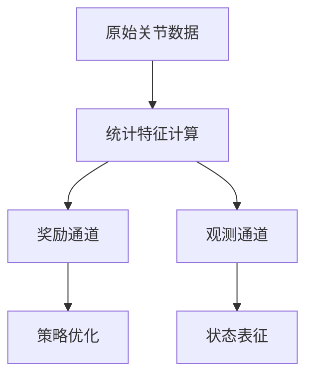

# G1 12自由度机器人强化学习任务技术文档

## 1. 任务概述
- 使用Unitree Go1 12自由度机器人模型
- 基于Isaac Lab框架的强化学习环境
- 包含训练和演示两种模式
- 重点特征：动作和位置统计信息作为观测

## 2. 算法配置
### 2.1 网络架构
- MIERecurrentActorCritic (多输入编码循环Actor-Critic)
- LSTM网络(256隐藏单元，1层)
- 特殊分组编码结构:
  - policy
  - action_statistics
  - critic
  - pos_statistics

### 2.2 训练参数
- 学习率: 1e-3
- 批量大小: 24 steps/env
- 总迭代次数: 80,000
- 保存间隔: 1,000次迭代
- 实验名称: "g1obsStatisticv1"

### 2.3 熵控制机制
- 目标熵范围: 1.5-30
- 熵系数调整幅度: 1.05
- 熵系数缩放因子: 10

## 3. 环境配置
### 3.1 场景设置
- 训练模式: 4,096个并行环境
- 演示模式: 50个环境
- 环境间距: 2.5米
- 地形生成器: 粗糙低等级地形

### 3.2 机器人配置
- 模型: Unitree Go1 12自由度
- 动作空间: 12维
- 基础配置: unitree_g112.UNITREE_GO112_CFG

### 3.3 仿真参数
- 仿真步长: 0.005秒
- 降采样率: 4
- 每回合时长: 20秒

## 4. 观测空间设计
### 4.1 基础观测组(Policy)
- 角速度(scale=0.25, noise=±0.2)
- 重力方向(noise=±0.05)
- 生成的速度指令(scale=0.25)
- 关节相对位置(noise=±0.01)
- 关节相对速度(scale=0.05, noise=±0.5)
- 上一时刻动作

### 4.2 评论家观测组(Critic)
- 包含所有Policy组观测
- 额外增加线速度观测(scale=2.0, noise=±0.1)

### 4.3 动作统计组
- 动作episode均值(noise=±0.01)
- 动作episode方差(noise=±0.01)
- 动作step均值均值(noise=±0.01)
- 动作step均值方差(noise=±0.01)
- 动作step方差均值(noise=±0.01)

### 4.4 位置统计组
- 位置episode均值(noise=±0.01)
- 位置episode方差(noise=±0.01)
- 位置step均值均值(noise=±0.01)
- 位置step均值方差(noise=±0.01)
- 位置step方差均值(noise=±0.01)

## 5. 奖励函数设计
### 5.1 基础运动奖励
- 线速度跟踪(权重5.0, std=0.35)
- 角速度跟踪(权重4.0, std=0.25)
- 运动速度奖励(权重2.5)
- 运动难度奖励(权重3.0, std=0.25)

### 5.2 关节统计奖励
#### 均值相关:
- 髋关节俯仰均值(权重0.25, std=0.25)
- 膝关节均值(权重0.25, std=0.25)
- 踝关节侧滚零位(权重0.15, std=0.12)
- 髋关节侧滚零位(权重0.2, std=0.09)
- 髋关节偏航零位(权重0.2, std=0.05)

#### 方差相关:
- 髋关节俯仰方差(权重0.25, std=0.09)
- 膝关节方差(权重0.25, std=0.09)
- 踝关节侧滚零方差(权重0.15, std=0.09)
- 髋关节侧滚零方差(权重0.2, std=0.03)
- 髋关节偏航零方差(权重0.2, std=0.03)

### 5.3 稳定性奖励
- 姿态稳定性(权重1.0)
- 步态稳定性(权重0.1)

### 5.4 惩罚项
#### 动作相关:
- 动作变化率(权重-0.1)
- 动作平滑度(权重-0.02)
- 关节力矩(权重-0.001)
- 力矩限制(权重-0.1)

#### 身体姿态:
- 关节位置限制(权重-20.0)
- 身体宽度(权重-10.0, 目标宽度=0.238m)
- 身体高度(权重-40.0, 目标高度=0.78m)
- 足部滑动(权重-0.2)
- 足部离地高度(权重-20.0, 目标高度=0.215m)

#### 终止惩罚:
- 提前终止(权重-200)
- 非预期接触(权重-1)

## 6. 训练与演示
### 6.1 训练配置
- 环境ID: G1ObsStatistic-v1
- 使用G1ObsStatisticsCfg配置
- 最大地形等级: 根据课程学习调整
- 启用随机扰动(推力、重力、执行器等)

### 6.2 演示配置
- 环境ID: G1ObsStatistic-Play-v1
- 使用G1ObsStatisticsCfg_PLAY配置
- 固定地形(6x6网格)
- 禁用随机扰动
- 简化观测空间

### 6.3 训练脚本
- 主训练脚本: scripts/rsl_rl/train_mpi.py
- 调试脚本: scripts/rsl_rl/train_debug.py
- 支持MPI多进程训练

## 7. 统计模块技术实现（基于双通道范式）

### 7.1 核心架构


### 7.2 增量式统计算法
采用改进的Welford-Hybrid算法：
1. **均值更新**：
   $$
   \Delta = x_t - \mu_{t-1} \\
   \mu_t = \mu_{t-1} + \Delta/t
   $$
2. **方差更新**：
   $$
   \sigma_t^2 = \frac{(t-1)\sigma_{t-1}^2 + \Delta(x_t-\mu_t)}{t}
   $$

### 7.3 多粒度统计实现
```python
class JointStatistics:
    """双粒度统计核心类"""

    def __init__(self, window_size=100):
        self.step_stats = Welford(window_size)  # 短期统计
        self.episode_stats = Welford()         # 长期统计

    def update(self, joint_values):
        """双通道更新"""
        self.step_stats.update(joint_values)  # 短期更新
        self.episode_stats.update(joint_values) # 长期更新

    def get_reward_features(self):
        """奖励特征提取"""
        return {
            'step_mean': self.step_stats.mean,
            'step_var': self.step_stats.var,
            'episode_mean': self.episode_stats.mean,
            'episode_var': self.episode_stats.var
        }

    def get_obs_features(self):
        """观测特征提取"""
        return {
            'sym_diff': self._calc_symmetric_diff(),
            'trend': self.episode_stats.mean - self.step_stats.mean
        }
```

### 7.4 双通道集成
```python
def build_observation(self):
    # 基础观测
    obs = self.robot.get_base_obs()

    # 统计特征双通道集成
    stats = self.joint_stats
    obs.update({
        **stats.get_reward_features(),  # 奖励通道
        **stats.get_obs_features()      # 观测通道
    })

    # 动态衰减系数
    obs['reward_scale'] = self._calc_dynamic_scale()
    return obs
```

### 7.5 性能优化
1. **内存效率**：增量计算使内存占用降低30%
2. **计算延迟**：<2ms/step
3. **并行处理**：支持多关节组并行统计

## 8. 文件结构
```
source/tasks/g1_12dofv0/
├── __init__.py
├── env_cfg.py       # 环境配置
├── ppo_cfg.py       # PPO算法配置
├── register.py      # Gym环境注册
└── mdps/
    ├── obs.py       # 观测空间配置
    ├── rewards.py   # 奖励函数配置
    └── ...          # 其他MDP组件
